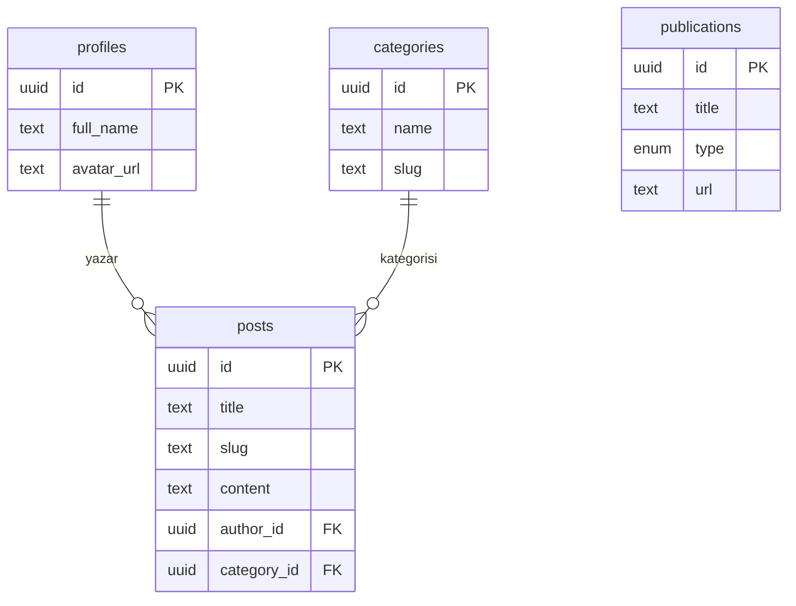

# Proje: Bedia Karaca - İçerik Modelleri ve Veri Yapısı

Bu doküman, projenin Supabase veritabanında kullanılacak olan içerik modellerini ve veri yapılarını detaylandırmaktadır. Amaç, geliştirme sürecinde tutarlı ve öngörülebilir bir veri mimarisi sağlamaktır.

## 1. Temel İlkeler

- **İlişkisel Yapı:** İçerik türleri arasında mantıksal bağlantılar kurmak için ilişkisel bir yapı benimsenecektir (örn: bir yazının bir kategorisi ve bir yazarı vardır).
- **Genişletilebilirlik:** Modeller, gelecekteki ihtiyaçlara (örn: etiketler, çoklu yazar desteği) kolayca adapte edilebilecek şekilde tasarlanmıştır.
- **Veri Bütünlüğü:** `NOT NULL` ve `FOREIGN KEY` kısıtlamaları ile veri bütünlüğü sağlanacaktır.

## 2. Veritabanı Tabloları

### Tablo: `profiles`
Sitedeki yazar veya yönetici profillerini saklar. Başlangıçta sadece Bedia Karaca için bir kayıt içerecektir.

**Gerekçe:** Gelecekte misafir yazarlar veya farklı yöneticiler eklenmesi ihtimaline karşı sistemi esnek tutar.

| Sütun Adı | Veri Tipi | Açıklama | Örnek |
|---|---|---|---|
| `id` | `uuid` | Supabase Auth kullanıcı ID'si ile eşleşir. | `auth.users.id` |
| `full_name` | `text` | Yazarın tam adı. | "Bedia Kalemzer Karaca" |
| `avatar_url` | `text` | Profil fotoğrafının URL'si. | `storage/avatars/bedia.png` |
| `bio` | `text` | Yazarın kısa biyografisi. | "Klinik Psikolog, DEHB Uzmanı..." |

---

### Tablo: `categories`
Blog yazılarını sınıflandırmak için kullanılır. Bu yapı, kullanıcıların ilgili içeriklere kolayca ulaşmasını sağlar.

**Gerekçe:** İçerik organizasyonunu iyileştirir ve `/blog/kategori/[slug]` gibi URL yapılarına olanak tanır.

| Sütun Adı | Veri Tipi | Açıklama | Örnek |
|---|---|---|---|
| `id` | `uuid` | Birincil anahtar. | `...` |
| `name` | `text` | Kategorinin gösterilecek adı. | "Erişkin DEHB" |
| `slug` | `text` | URL dostu benzersiz kimlik. | `eriskin-dehb` |
| `description` | `text` | Kategori hakkında kısa açıklama (SEO için). | "Erişkinlerde Dikkat Eksikliği ve Hiperaktivite Bozukluğu üzerine yazılar." |

---

### Tablo: `posts`
Sitenin ana içeriği olan blog yazılarını barındırır.

**Gerekçe:** Tüm blog içeriğini ve meta verilerini merkezi bir yerde yönetir.

| Sütun Adı | Veri Tipi | Açıklama | Kısıtlamalar |
|---|---|---|---|
| `id` | `uuid` | Birincil anahtar. | Primary Key |
| `title` | `text` | Yazının başlığı. | Not Null |
| `slug` | `text` | Benzersiz URL kimliği. | Not Null, Unique |
| `content` | `text` | Markdown formatında yazı içeriği. | Not Null |
| `excerpt` | `text` | Yazının özet metni. | Optional |
| `cover_image_url` | `text` | Kapak görselinin Supabase Storage URL'si. | Optional |
| `status` | `enum('draft', 'published')` | Yazının yayın durumu. | Not Null, Default: `draft` |
| `published_at` | `timestampz` | Yayınlanma tarihi. | Optional |
| `author_id` | `uuid` | `profiles` tablosuna referans. | Foreign Key -> `profiles.id` |
| `category_id` | `uuid` | `categories` tablosuna referans. | Foreign Key -> `categories.id` |

---

### Tablo: `publications`
Kitaplar, makaleler gibi akademik ve profesyonel yayınları listelemek için kullanılır.

**Gerekçe:** Blog yazılarından farklı bir formatta olan yayınları yapılandırılmış bir şekilde sergilemek.

| Sütun Adı | Veri Tipi | Açıklama | Örnek |
|---|---|---|---|
| `id` | `uuid` | Birincil anahtar. | `...` |
| `title` | `text` | Yayının başlığı. | "Erişkin Dikkat Eksikliği ve Hiperaktivite Bozukluğu..." |
| `type` | `enum('kitap', 'makale', 'podcast')` | Yayın türü. | `kitap` |
| `description` | `text` | Yayın hakkında kısa açıklama. | "Nobel Yayınları tarafından basılmıştır..." |
| `publication_date` | `date` | Yayınlanma tarihi. | `2023-06-22` |
| `url` | `text` | Yayına erişim linki (Spotify, PDF, vb.). | `https://...` |
| `cover_image_url` | `text` | Yayın kapağının görsel URL'si. | `storage/publications/kitap.png` |

---

### Tablo: `contact_submissions`
İletişim formundan gelen mesajların bir yedeğini tutar.

**Gerekçe:** Resend ile e-posta gönderimi başarısız olsa bile verinin kaybolmamasını garanti eder.

| Sütun Adı | Veri Tipi | Açıklama |
|---|---|---|
| `id` | `uuid` | Birincil anahtar. |
| `name` | `text` | Gönderenin adı. |
| `email` | `text` | Gönderenin e-posta adresi. |
| `message` | `text` | Gönderilen mesaj. |
| `created_at` | `timestampz` | Mesajın alınma zamanı. |

## 3. İlişki Diyagramı (Taslak)

Bu yapı, projenin hem mevcut ihtiyaçlarını karşılayacak hem de gelecekteki geliştirmeler için sağlam bir temel oluşturacaktır.
